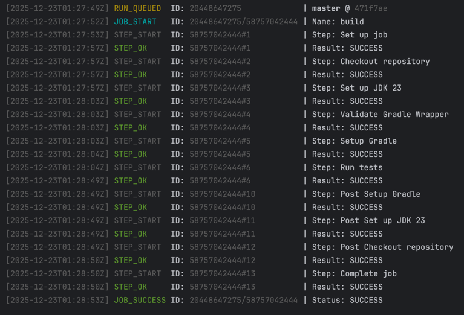

# GitHub Actions Watch

This is a Kotlin CLI tool that monitors GitHub Actions workflow activity for a repository and prints one line per event to stdout. It reports:

- New workflow runs being queued
- Jobs starting and finishing (with conclusion)
- Steps within jobs starting and finishing (success/failure)
- Branch names, commit SHAs, and timestamps
- Resumes from where it left off using a small on-disk state per repository



## State and resuming

- State files are stored under the state directory (default: .github-actions-watch)
- One file per repository, named like Owner__Repo.json

## Build and usage

### Requirements

- JDK 23 or newer
- GitHub Personal Access Token

### Run
```bash
./gradlew run --args "--repo owner/repo --token $GITHUB_TOKEN"
```

### Usage

github-actions-watch --repo owner/repo [options]

Options

- -r, --repo <owner/repo>    Required repository identifier
- -t, --token <token>        If omitted, the GITHUB_TOKEN env var is used
- --poll-seconds <int>       Polling interval in seconds (default: 10)
- --state-dir <path>         Directory for state files (default: .github-actions-watch)
- --request-timeout-ms <n>   GitHub API request timeout in ms (default: 5000)

Environment

- GITHUB_TOKEN  Used if --token is not provided

## License

MIT. See [LICENSE](LICENSE).
